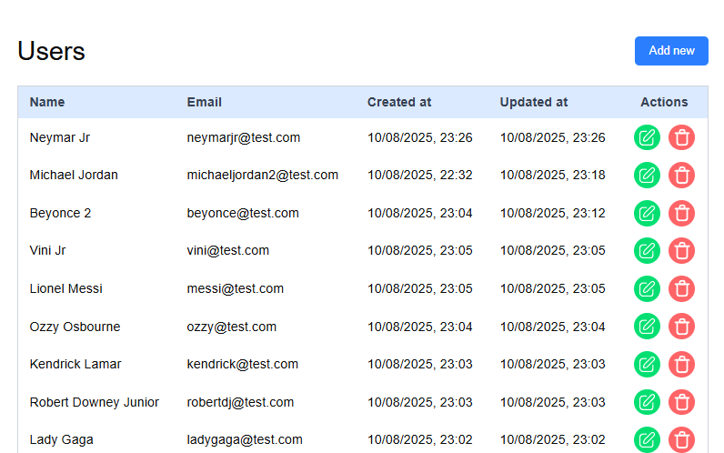

# 📋 Users manager — A full stack project

This project is a simple **User Management System** with  
**Frontend: React + TypeScript + Tailwind**  
**Backend: NestJS + PostgreSQL + Prisma**


It allows you to create, list, update, and delete users with an easy-to-use interface.

---

## 🛠 Tech Stack

### **Frontend**

- **React** — UI library
- **TypeScript** — Static typing
- **Tailwind CSS** — Utility-first CSS
- **React Query** — API state and cache management
- **React Hook Form** — Form handling and validation

### **Backend**

- **NestJS** — Node.js framework for APIs
- **PostgreSQL** — Relational database
- **Prisma** — ORM for database access
- **Class Validator / Transformer** — Input validation

---

## 🚀 Features

### **Frontend**

- Create user via form
- Edit user via form
- Delete user
- List all users

### **Backend**

Available in another repository: https://github.com/cairoaraujo/nextjs-users-list

---

## 📦 How to run

### **1. Clone the repository**

```bash
# Frontend
git clone https://github.com/cairoaraujo/nextjs-users-list.git
cd nextjs-users-list
```

```bash
# Run
npm install
npm run dev
```
